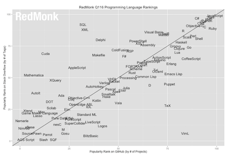
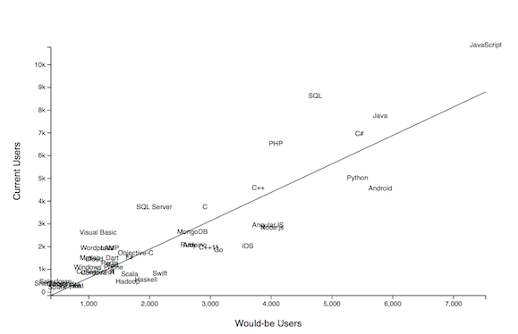
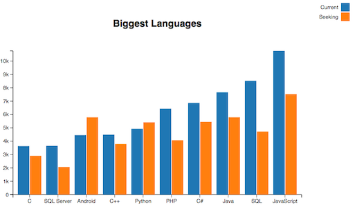
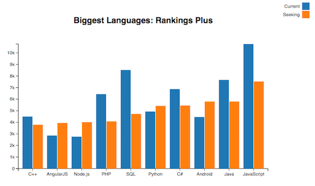
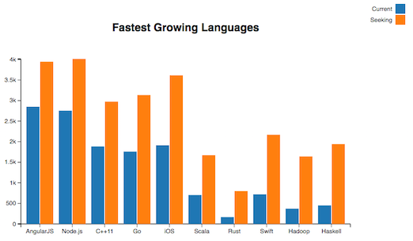

title: Ranking Programming Languages
author:
  name: Nathan Epstein
  twitter: epstein_n
  url: http://nepste.in
  email: _@nepste.in

--

# Predicting the Growth of Programming Languages

--

### Motivation

- Build a model to benchmark programming languages (and frameworks)
- We want something to signal current standings and tell us something about the future

--



--

### Redmonk Language Rankings

- The Redmonk Language Rankings have been around since 2010 (regressing Github repo count against Stack Overflow posts).
- The fact that the repo count and post count are correlated is a source of comfort but doesn’t provide forward guidance.

--

### The (New) Model
- Stack overflow survey contains data on what languages people
  - want to use and
  - what languages they do use

--

### The (New) Model

- Using the SO data, we can build a regression to predict equilibrium usage per desired user base.
- Intuitively, if the number of people wishing to use a technology is much smaller/larger than the actual user base, the user base should shrink/grow.

--

### Exploring the Model

- Now we can look at some charts to explore the model and it's results.
- All charts here made with D3xter (more info @ d3xter.io)

--

### The Data

```javascript
var languages = [
  {
    name: 'Sharepoint',
    users: 299,
    seekers: 378,
    predicted: -149.1512547600487
  },
  ...,
  {
    name: 'JavaScript',
    users: 10769,
    seekers: 7529,
    predicted: 8802.345827352598
  }
];

```

--

# Visualizing the Model

--
``` javascript
new D3xter({
  xLab: "Would-be Users",
  yLab: "Current Users",
  height: 600,
  width: 900
}).plot({
  datasets: [
    {
      x: languages.map(function(lang) { return lang.seekers }),
      y: languages.map(function(lang) { return lang.users }),
      labels: languages.map(function(lang) { return lang.name }),
      color: 'black'
    },
    {
      x: [languages[0].seekers, languages.slice().pop().seekers],
      y: [languages[0].predicted, languages.slice().pop().predicted],
      color: 'black',
      line: true
    }
  ]
});
```
--



--

# Biggest Languages

--
```javascript
var bigLangs = languages.sort(function(a, b) {
  return a.users - b.users;
}).slice(languages.length - 10);

var myBar = new D3xter({
  title: "Biggest Languages",
  width: 800
}).bar({
  labels: ["Current", "Seeking"],
  groups: bigLangs.map(function(lang) { return lang.name }),
  datasets: [
    {
      values: bigLangs.map(function(lang) { return lang.users }),
    },
    {
      values: bigLangs.map(function(lang) { return lang.seekers }),
    }
  ]
});

```
--



--

# Rankings Plus

--
```javascript
var bigLangs = languages.slice(languages.length - 10);
var myBar = new D3xter({
  title: "Biggest Languages: Rankings Plus",
  width: 800
}).bar({
  labels: ["Current", "Seeking"],
  groups: bigLangs.map(function(lang) { return lang.name }),
  datasets: [
    {
      values: bigLangs.map(function(lang) { return lang.users }),
    },
    {
      values: bigLangs.map(function(lang) { return lang.seekers }),
    }
  ]
});
```
--



--

# Fastest Growing Languages

--
```javascript
var growLangs = languages.sort(function(a, b) {
  return (a.predicted / a.users) - (b.predicted / b.users);
}).slice(languages.length - 10);

var myBar = new D3xter({
  title: "Fastest Growing Languages",
  width: 800
}).bar({
  labels: ["Current", "Seeking"],
  groups: growLangs.map(function(lang) { return lang.name }),
  datasets: [
    {
      values: growLangs.map(function(lang) { return lang.users }),
    },
    {
      values: growLangs.map(function(lang) { return lang.seekers }),
    }
  ]
});
```
--



--

# Interpreting our Model

--

### What does this mean for JS?
- Vanilla JS is shrinking but still huge.
- Node.js and AngularJS are big and rapidly getting bigger.
- One interpretation is that the JS community is getting more organized.

--

### Prediction: "Growth" Languages
All of the following are predicted to see growth: Haskell, Hadoop, Swift, Rust, Scala, iOS, Go, C++11, Node.JS, AngularJS

--
### Results: "Growth" Languages

- Hadoop, Swift, iOS, Go, Node.js, and AngularJS were all listed as "trending" upwards in this year's SO developer survery (correct).
- C++11 was not listed as either "trending" up or down (ambiguous).
- Haskell, Rust, and Scala were listed as "trending" down (incorrect).

--

### Results: "Growth" Languages (continued)

- Notably, the model seems to have problems with predicting growth for "small" languages. Haskell, Rust, and Scala were the smallest 3 "growth" languages.
- The intuitive interpretation is that small languages don't have the existing community to capitalize on the hype that feeds large expected growth.
--

### Prediction: "Big" Languages
- Ambigious / Mild Losses: JS, Java, C#, C++, C
- Winners: Python, Android, AngularJS, Node.js, iOS
- Losers: SQL, PHP

--

### Results: "Big" Languages

- Above predictions are accurate.
- Mild losses for Java, C#, C++, and C; JS "trending" slightly updwards.
- Python, Android, AngularJS, Node.js, and iOS all "trending" upwards
- SQL and PHP "trending" downwards.

--

### Conclusions

- We'll need to wait for published SO survey data to update predictions / rankings.
- Simple model looks to be a good way to benchmark programming languages.
- JS is staying big. Frameworks are growing. Long live JS!
